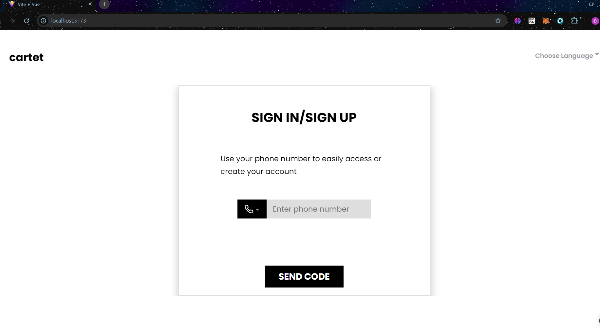
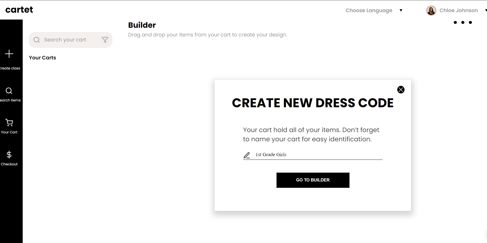
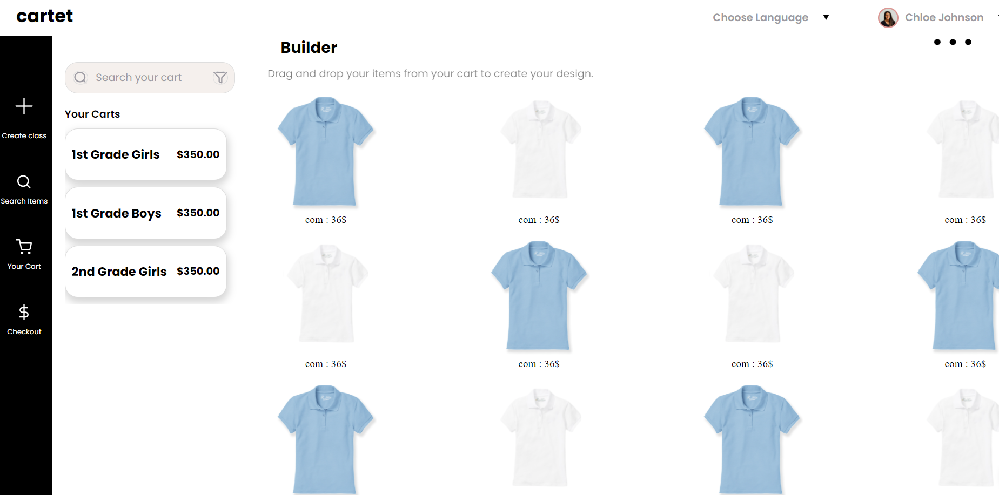

# Project Title

CARTET

## Table of Content:

- [About The App](#about-the-app)
- [Screenshots](#screenshots)
- [Technologies](#technologies)
- [Setup](#setup)
- [Status](#status)

## About The App

This project is to turn given Figma design into Vue. It's Ecommerce Vue Frontend.

## Screenshots

## Technologies

`Vite`, `Vue3`, `Vue-Router`

## Setup

- download or clone the repository
- run `yarn` to setup necessary node_modules
- run `yarn dev`

## Status

CARTET is completed.
